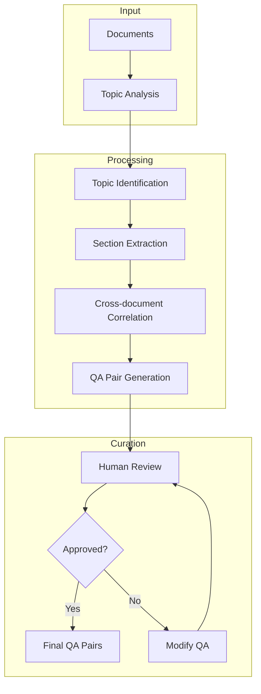
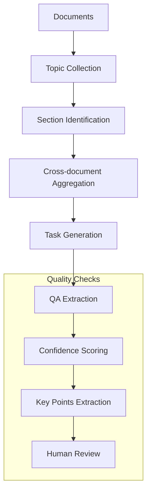
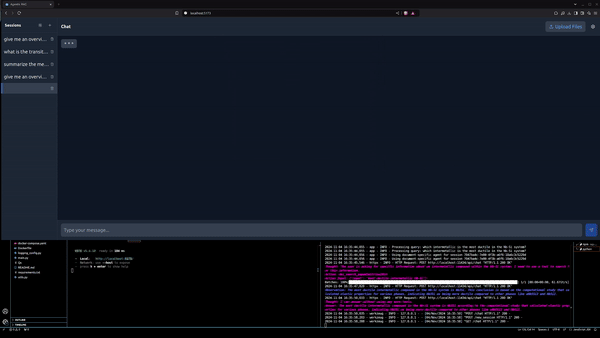
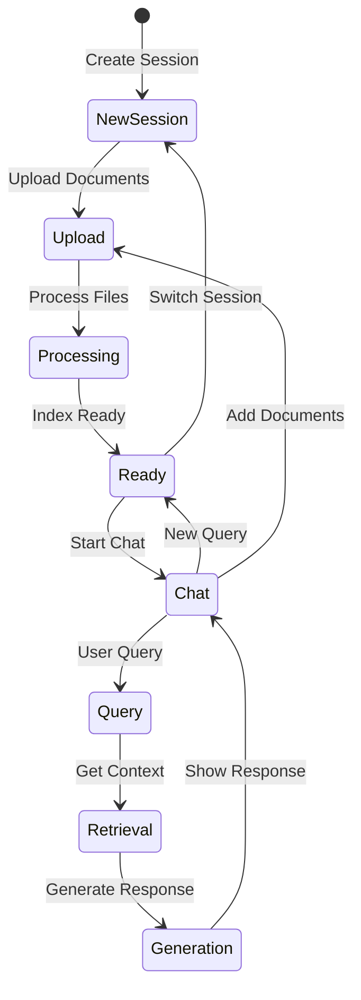
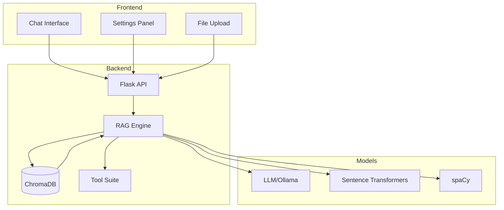
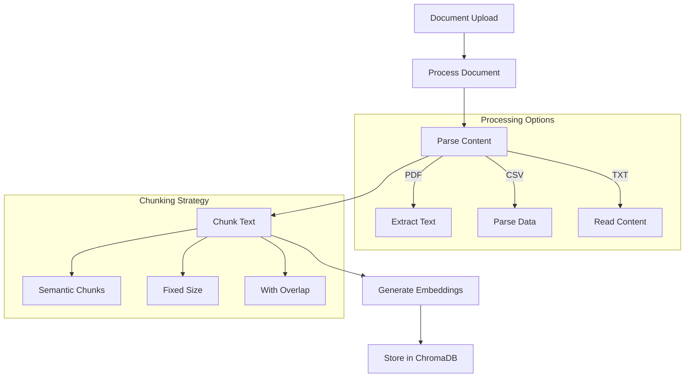
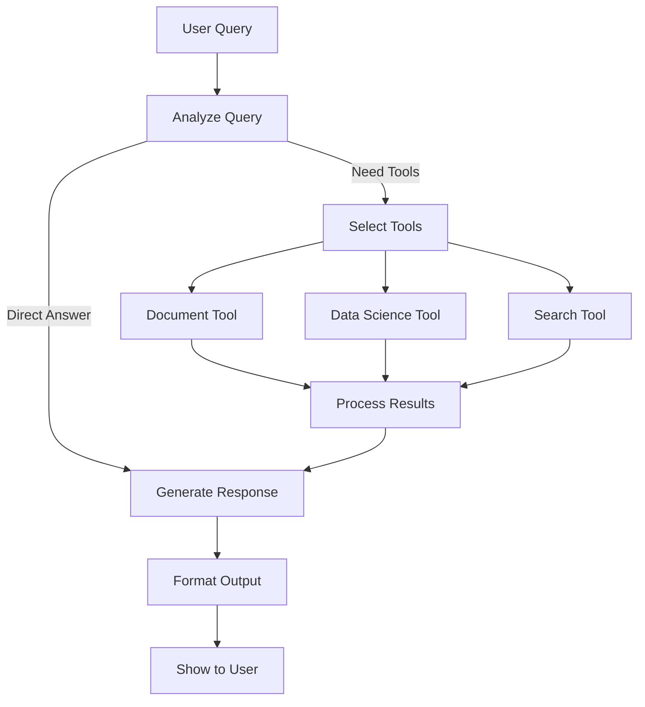
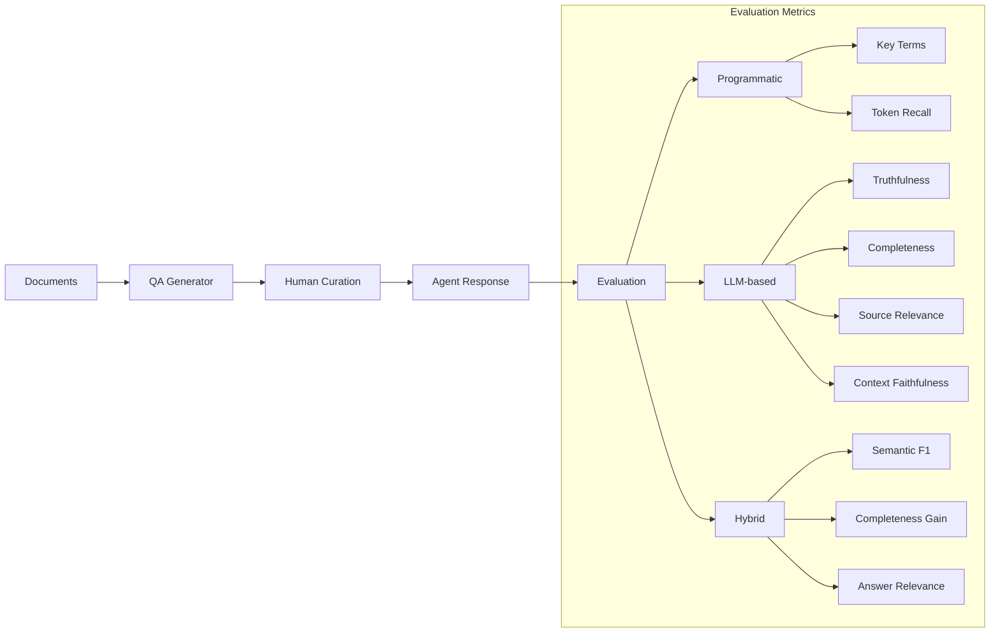

# RAG Chat Application

A React-Flask application that implements Retrieval-Augmented Generation (RAG) for document-based conversations. This application allows users to upload documents (PDFs, CSVs) and chat with an AI that can reference and retrieve information from these documents.

## Features

- 💬 Interactive chat interface
- 📁 Document upload and processing
- 🔍 Retrieval-augmented responses
  - Vector search
  - Semantic chunking
  - Summarization
  - Tools
    - Document tool use
    - Data science tool use
- 🗂️ Session management
- ⚙️ Configurable model settings
- 🎨 Modern, responsive UI
- 📊 Comprehensive RAG evaluation system
  - Automated QA pair generation
  - Human curation interface
  - Multi-metric evaluation (programmatic, LLM-based, and hybrid) with option for human eval
  - Detailed performance analytics

## Tech Stack

### Backend
- Flask
- LlamaIndex
- Chromadb
- Ollama
- Sentence Transformers
- spaCy

### Frontend
- React
- Vite
- TailwindCSS
- React Router
- Headless UI
- Lucide Icons

## Prerequisites

- Python 3.10+
- Node.js 16+
- npm/yarn
- Ollama with models installed (Llama, Qwen)
- spaCy English model (`python -m spacy download en_core_web_sm`)

💡 **Resource Note:**
Running a full suite of ablation experiments with 2-3 different models costs roughly $4 in electricity - that's less than a coffee! Perfect for researchers and hobbyists looking to experiment with state-of-the-art RAG systems on consumer hardware.

## Installation

### Backend Setup

1. Clone the repository
```bash
git clone [your-repo-url]
cd [repo-name]
```

2. Create and activate virtual environment
```bash
python -m venv rag_app_env
source rag_app_env/bin/activate  # On Windows: .\rag_app_env\Scripts\activate
```

3. Install Python dependencies
```bash
pip install -r requirements.txt
python -m spacy download en_core_web_sm
```

### Frontend Setup

1. Navigate to frontend directory
```bash
cd rag-frontend
```

2. Install dependencies
```bash
npm install
```

# RAG Playground 

## Data Generation and Processing

The application includes sophisticated data generation capabilities for training and evaluation:

### QA Pair Generation
- **Cross-document Topic Analysis**: Automatically identifies and correlates related topics across multiple documents
- **Semantic Chunking**: Intelligent text segmentation based on topic coherence
- **Multi-stage Processing**:
  1. Topic Identification
  2. Section Extraction
  3. QA Pair Generation
  4. Human Curation Interface



### Summarization Tasks
- **Automated Topic Discovery**: Identifies key topics and their relationships
- **Cross-document Aggregation**: Combines related information across multiple sources
- **Hierarchical Processing**:
  1. Topic Collection
  2. Section Identification
  3. Task Generation
  4. Quality Assurance



### Checkpoint System
- Automated progress saving during processing
- Resume capability for interrupted operations
- Progress tracking and reporting

## Handy Tools

### Model Finetuning
The repository includes a script (`finetuning/unsloth.py`) for finetuning LLMs on generated QA pairs:
- Uses Unsloth's optimization techniques for efficient training
- Supports LoRA adapters for parameter-efficient finetuning
- Configurable for different model sizes and architectures
- Includes chat template formatting for consistent training
- Features:
  - 4-bit quantization support
  - Gradient checkpointing
  - Custom chat template application
  - Inference utilities

## Running the Application

### Development Mode

1. Start the Flask backend
```bash
# In the root directory
python app.py
```

2. Start the React frontend
```bash
# In the rag-frontend directory
npm run dev
```

3. Access the application at `http://localhost:5173`

### Production Mode

1. Build the frontend
```bash
cd rag-frontend
npm run build
```

2. Run with Docker Compose
```bash
docker-compose up --build
```

## Usage

1. **Start a New Session**
   - Click the "+" button in the sidebar
   - Enter a session name

2. **Upload Documents**
   - Click "Upload Files" button
   - Select PDF or CSV files
   - Wait for processing confirmation

3. **Chat Interface**
   - Type messages in the input field
   - View responses in the chat window
   - Switch between sessions using the sidebar

4. **Configure Settings**
   - Click the settings icon
   - Select different models and embeddings
   - Save changes



5. **RAG Evaluation System**
   - Generate QA pairs from documents:
     ```bash
     python qa_generator.py -i /path/to/docs -o qa_pairs.json
     python summarization_qa_generator.py -i /path/to/docs -o summary_qa_pairs.json # use in conjunction with an agent to provide more accurate curation
     ```
   - Curate generated QA pairs manually in the JSON file
   - Generate agent responses:
     ```bash
     python response_generator.py -q qa_pairs_curated.json -d docs/
     ```
   - Run evaluation metrics:
     ```bash
     python metrics_eval.py -q qa_pairs_curated_with_responses.json
     ```

### Chat Session Workflow


## Project Structure

```
.
├── agent_networks
│   ├── agents_full_suite
│   │   ├── custom.py
│   │   └── react.py
│   ├── agents_search_only
│   │   ├── custom.py
│   │   └── react.py
│   ├── __init__.py
│   ├── naive_rag
│   │   ├── naive_rag.py
├── data
│   ├── chromadb
│   │   ├── chromadb
│   │   ├── default_vector_store
│   │   └── document_store
│   ├── document1.pdf
│   │   ├── default__vector_store.json
│   │   ├── docstore.json
│   │   ├── graph_store.json
│   │   ├── image__vector_store.json
│   │   └── index_store.json
│   └── storage
├── dataset_generation
│   ├── json-transform.py
│   ├── qa_generator.py
│   └── summarization_qa_generator.py
├── docker-compose.yaml
├── Dockerfile
├── finetuning
│   └── unsloth.py
├── logging_config.py
├── logs
│   ├── app.log
│   └── summary_qa_extraction.log
├── main.py
├── metrics_eval.py
├── queue.sh
├── rag-frontend
├── README.md
├── reports
│   ├── comparative_plot.py
├── requirements.txt
├── response_generator.py
├── sessions
├── utils.py
```

### RAG System Architecture


### Document Processing Flow


## Retrieval

The system implements a modular retrieval architecture with three distinct strategies:

1. **Naive Retrieval** (`RetrieverType.NAIVE`)
   - Pure vector similarity search
   - Uses VectorStoreIndex with configurable `similarity_top_k`
   - Best for simple queries where semantic similarity is sufficient

2. **Naive with Reranking** (`RetrieverType.NAIVE_RERANKER`)
   - Vector similarity search followed by cross-encoder reranking
   - Uses SentenceTransformerRerank with "cross-encoder/ms-marco-MiniLM-L-2-v2"
   - Improves result relevance by reranking initial candidates
   - Default retrieval strategy

3. **Hybrid Search** (`RetrieverType.HYBRID`)
   - Combines vector similarity and keyword-based (BM25) search
   - Supports "AND" mode (intersection of results) and "OR" mode (union of results)
   - Best for queries that benefit from both semantic and lexical matching
   - Includes reranking step for final result refinement

Usage:
```python
from retrievers import RetrieverType

# Initialize with specific retriever type
agent = AgentNetwork(retriever_type=RetrieverType.HYBRID)

# Use default (naive with reranking)
agent = AgentNetwork()

# Configure retriever parameters
query_engine = get_retriever(
    RetrieverType.HYBRID,
    nodes,
    similarity_top_k=15,  # Number of initial candidates
    rerank_top_n=3,      # Number of results after reranking
    mode="OR"           # Hybrid search mode ("AND" or "OR")
)
```

The retrieval system is designed to be modular and easily extensible, allowing for:
- Easy switching between retrieval strategies
- Consistent interface across different implementations
- Simple addition of new retrieval methods
- Fine-tuning of parameters for specific use cases

Each retriever implementation maintains the same core workflow while optimizing for different retrieval scenarios, making it easy to experiment with different approaches for various types of queries and document collections.

## Evaluation Metrics

The system employs a comprehensive evaluation framework combining programmatic, LLM-based, and hybrid metrics to assess response quality.

### Programmatic Metrics

#### Key Terms Precision (Weight: 0.15, Threshold: 0.7)
- Identifies important non-stop words from context
- Measures overlap of key terms between response and ground truth
- Considers domain-specific vocabulary and technical terms
- Useful for assessing technical accuracy and domain knowledge

#### Token Recall (Weight: 0.15, Threshold: 0.7)
- Measures what percentage of ground truth tokens are captured
- Focuses on information completeness
- Higher scores indicate comprehensive coverage
- Helps identify incomplete or partial answers

### LLM-based Metrics

#### Truthfulness (Weight: 0.2, Threshold: 0.7)
- LLM evaluates factual accuracy of response
- Considers contradiction and consistency with ground truth
- Scores from 0 (completely false) to 1 (completely truthful)
- Critical for ensuring factual correctness

#### Completeness (Weight: 0.1, Threshold: 0.7)
- Assesses whether all key points from ground truth are covered
- Identifies missing important information
- Considers both explicit and implicit information
- Important for comprehensive answers

#### Source Relevance (Weight: 0.05, Threshold: 0.7)
- Evaluates quality of retrieved context chunks
- Emphasizes presence of crucial information
- Weights heavily toward best source (80/20 split if highly relevant source found)
- Success criteria: at least one highly relevant source, even if others are less relevant

#### Context Faithfulness (Weight: 0.1, Threshold: 0.7)
- Evaluates if response stays true to provided context
- Identifies any statements contradicting or unsupported by context
- Focuses purely on factual consistency, not completeness
- Important for preventing hallucination or incorrect inferences

### Hybrid Metrics

#### Semantic F1 (Weight: 0.1, Threshold: 0.6)
- Combines semantic similarity with precision/recall measurement
- Uses embedding-based matching of key points between response and ground truth
- Matches points using similarity threshold (0.8) to allow for paraphrasing
- Calculates F1 score based on matched points
- More flexible than exact matching but still maintains accuracy
- Lower threshold (0.6) accounts for valid alternative phrasings

#### Completeness Gain (Weight: 0.05, Threshold: 0.501)
- Novel metric measuring potential improvements over ground truth
- Evaluates response completeness relative to full context, not just ground truth
- Process:
  1. Extracts ALL relevant points from context given the question
  2. Measures coverage of these points in both ground truth and response
  3. Calculates relative gain in coverage
  4. Normalizes score where:
     - 0.5 means equal coverage to ground truth
     - >0.5 means better coverage than ground truth
     - <0.5 means worse coverage than ground truth
- Threshold of 0.501 chosen to identify any cases where agent provided better coverage
- Includes semantic verification of extra points claimed by response
- Particularly valuable for:
  - Identifying areas where curated answers could be improved
  - Measuring agent's ability to provide more comprehensive answers
  - Understanding context utilization effectiveness
- Example case:
  ```
  Question: "What industries use AI?"
  Context: [Details about AI in healthcare, finance, retail, manufacturing, education]
  Ground Truth: "AI is used in healthcare, finance, and retail."
  Response: "AI is used in healthcare, finance, retail, manufacturing, and education."
  Result: Completeness gain > 0.5 as response covers more relevant industries from context
  ```

#### Answer Relevance (Weight: 0.1, Threshold: 0.7)
- Combines embedding similarity with LLM judgment
- Embedding similarity: Uses sentence-transformers model
- LLM assessment: Evaluates semantic meaning and relevance
- Final score: Weighted average (50/50) of embedding and LLM scores
- Effective for capturing meaning beyond lexical similarity

### Score Interpretation

For all metrics except Semantic F1 and Completeness Gain:
- Excellent: > 0.8 (80%)
- Good: 0.6-0.8 (60-80%)
- Fair: 0.4-0.6 (40-60%)
- Poor: < 0.4 (40%)

For Semantic F1:
- Excellent: > 0.7 (70%)
- Good: 0.5-0.7 (50-70%)
- Fair: 0.2-0.5 (20-50%)
- Poor: < 0.2 (20%)

For Completeness Gain:
- Anything above 0.5 (50%) is considered a gain

Note that thresholds can be adjusted based on specific use cases and requirements. Critical applications may require higher thresholds.

### Aggregate Scoring

The final evaluation combines metric scores weighted by importance:
- Programmatic metrics: 25% of total score
- LLM-based metrics: 45% of total score
- Hybrid metrics: 30% of total score

The aggregate pass rate requires 6/8 (excluding completeness gain as it is a gain metric) passed metrics (can be adjusted via OVERALL_PASS_THRESHOLD)
Apart from that, numerical accuracy hybrid metric is also reported indepedently. This metric describes how accurate the agent is when asked to retrieve a specific number.

This balanced approach ensures consideration of:
- Objective lexical measures
- Semantic understanding
- Context utilization
- Potential improvements over ground truth

### RAG Tool Usage Flow


### RAG evaluation Pipeline


## API Endpoints

- `GET /chat` - Retrieve chat sessions and history
- `POST /chat` - Send messages and process responses
- `GET /settings` - Get current settings
- `POST /settings` - Update settings
- `GET /new_session` - Create new chat session
- `POST /new_session` - Create new chat session
- `POST /delete_session/<session_id>` - Delete a session
- `POST /switch_session/<session_id>` - Switch between sessions

## Contributing

1. Fork the repository
2. Create a feature branch
3. Commit your changes
4. Push to the branch
5. Create a Pull Request

Copy## Citation

If you use RAG Playground in your research, please cite this paper:

```bibtex
@misc{papadimitriou2024ragplaygroundframeworksystematic,
      title={RAG Playground: A Framework for Systematic Evaluation of Retrieval Strategies and Prompt Engineering in RAG Systems}, 
      author={Ioannis Papadimitriou and Ilias Gialampoukidis and Stefanos Vrochidis and Ioannis and Kompatsiaris},
      year={2024},
      eprint={2412.12322},
      archivePrefix={arXiv},
      primaryClass={cs.LG},
      url={https://arxiv.org/abs/2412.12322}, 
}

## License

GPL